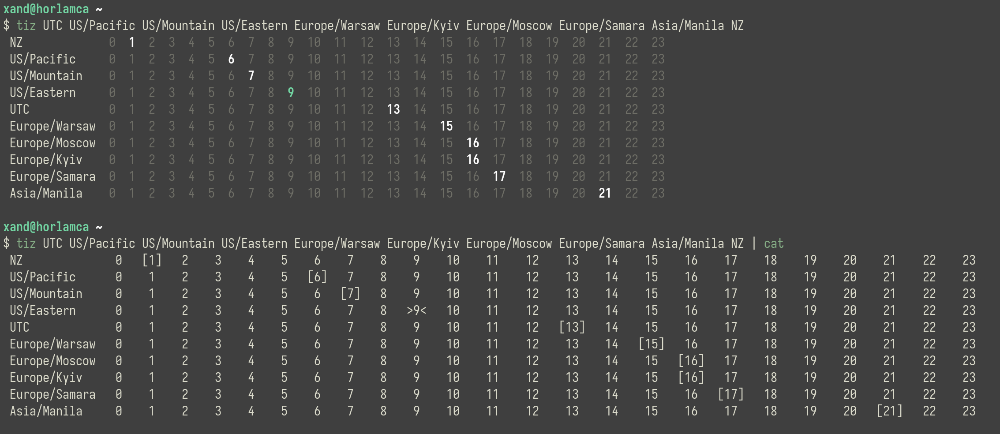

tiz
===============================================================================

Time In Zones: print a table of times in given zones.

demo
----

Note that the list of zones can be passed as either space-separated arguments
or `stdin` lines.

